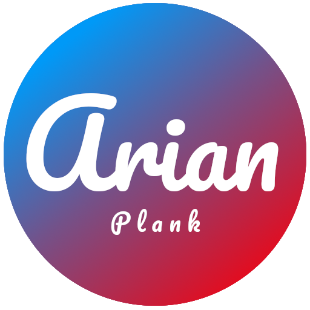

<p align="center">
<a href="https://www.pling.com/p/1911700/" target="_blank"></a>
<p>
  <h1 align="center"> Arian Theme for Plank Dock </h1> 


My Favorite Theme for Plank Dock

<a href="https://www.pling.com/p/1911700/"></a>
    

<a style="display: block" href="https://www.pling.com/p/1911700/"></a>

<br>


### How to install Arian Theme for Plank:
```Shell
git clone https://github.com/aryanhosseini/arian-plank-theme.git
cd arian-plank-theme/
sh install.sh 
```
<br>

 

 
 
 


## Screentshots


