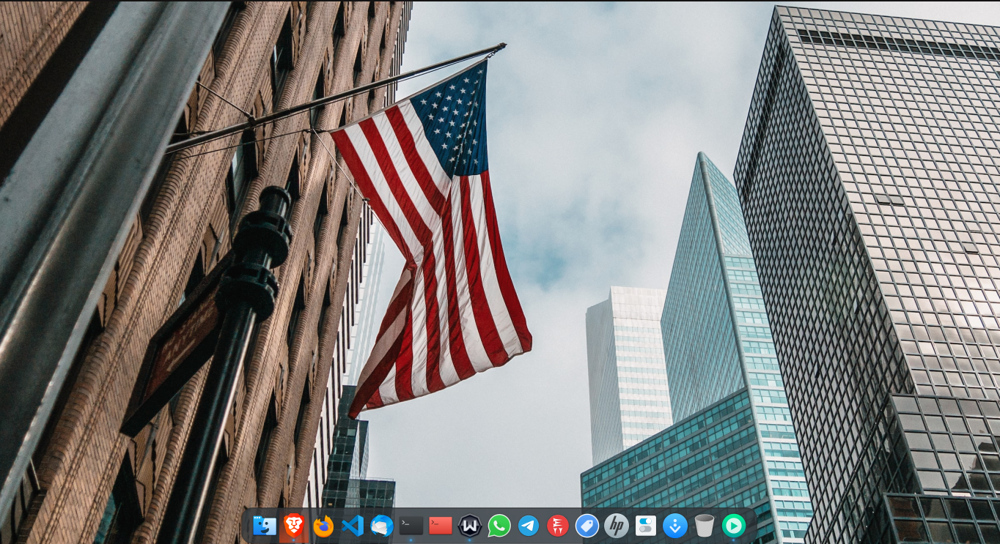

<p align="center">
<a href="https://www.pling.com/p/1911700/" target="_blank"></a>

<p>
  <h1 align="center"> Arian Theme for Plank Dock </h1> 
  <h2 align="center">
  
  [](https://aur.archlinux.org/packages/plank-theme-arian-git/)
  
  [](https://aur.archlinux.org/packages/plank-theme-arian-git/)
  
  </h2>


My Favorite Theme for Plank Dock 


<a href="https://www.pling.com/p/1911700/"></a>
    

<a style="display: block" href="https://www.pling.com/p/1911700/"></a>
    
    
<a style="display: block" href="https://www.pling.com/p/1911700/"></a>

<br>


## Installation
To Install Arian Plank Theme, Check out the following guide

### Arch Linux (AUR)
If you're on Arch Linux, You can simply install the package from the AUR, Feel free to use your favorite AUR Helper
```Shell
paru -S plank-theme-arian-git
yay -S plank-theme-arian-git
```


 
 

### Other Distributions / Manually
```Shell
git clone https://github.com/ryanhosseini/arian-plank-theme.git
cd arian-plank-theme/
sh install.sh 
```

 
 
 


<br>


## Screentshots


